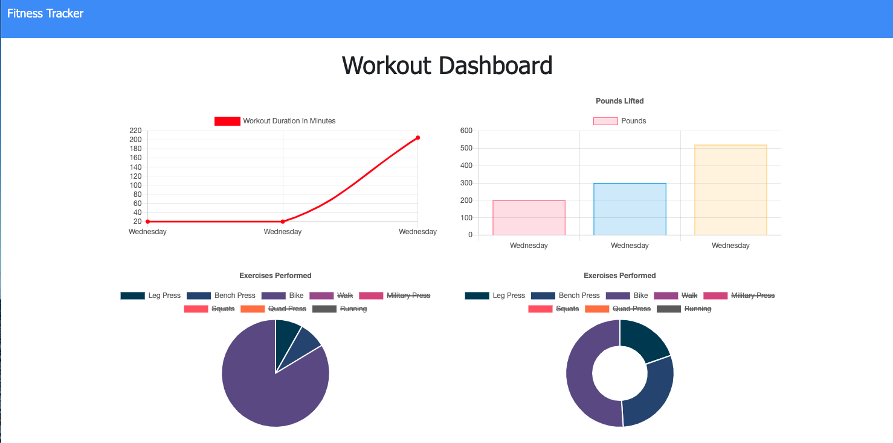
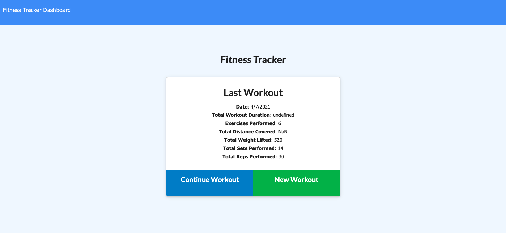

#  Workout Tracker - Lets Move

## Description 

Tasked with creating a workout tracker app by adding to and editing the starter code provided. The functioning app has been launched using Heroku, uses NPM packages as well as Mongodb & MongoAtlas.

---

## User Story

* As a user, I want to be able to view create and track daily workouts. I want to be able to log multiple exercises in a workout on a given day. I should also be able to track the name, type, weight, sets, reps, and duration of exercise. If the exercise is a cardio exercise, I should be able to track my distance traveled.

---

## Development 

Public & seeder folders were provided and I did not have to do too much refactoring to the files within those folders, I did create a few new folders and files, they are described below.  

 - [ ] New files and folders
     - [ ] Models
        - [ ] index.js
        - [ ] workout.js
     - [ ] Routes
        - [ ] api.js
        - [ ] view.js
     - [ ] server.js
- [ ] DB  
    - [ ] Create Workout, workoutSchema using mongoose + connect Mongo  
    - [ ] Create collection within db allowing for workout and exercises to be stored
    - [ ] Using MongoDB Atlas with account and process.env used with Heroku 
- [ ] NPM packages
    - [ ] Express & mongoose required - listed in dependencies 
    - [ ] Node command line called on server.js - listed as start file 
- [ ] Notable files  
    - [ ] view.js is what the user "views" aka html routes
    - [ ] routes/api.js contains server routes to get, post, create and delete
- [ ] Heroku
    - [ ] App needed to be deployed to Heroku
    - [ ] Live link included below  

---

## Installation 

NPM install for express & mongoose  - other files required throughout the app once they are created. Ensure these are listed on package.json as dependencies.

--- 

## Preview 

---

## Heroku Link 

https://stark-wildwood-59110.herokuapp.com/

---

## Github Link

https://github.com/vshulman25/burgerama

--

## Credits

Developer - Victoria Shulman 

